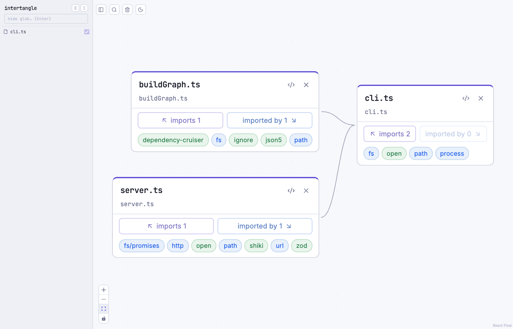

# intertangle

Explore a TypeScript/JavaScript project's import graph on an infinite canvas in your
browser. Start from the files you care about and pull in their dependencies — in either
direction — on demand, with the source right there.



## What it does

- Run it inside any TS/JS project; it scans the project once and opens a browser.
- Each file is a **card**, folded by default (name + path + dependency counts).
- Click `imports (n) ▸` or `imported by (m) ◂` to reveal related files as new cards,
  laid out automatically with no overlaps, growing outward from where you clicked.
- Expand a card to read its full source, syntax-highlighted.
- External packages (`node_modules`, node core) show as inert labels — the graph stays
  scoped to your own code.
- TypeScript path aliases resolve automatically from your `tsconfig`.
- Runs entirely on your machine. Nothing leaves it.

## Requirements

Node ≥ 18

## Install

```sh
npm i -g intertangle
```

## Usage

```sh
# seed the canvas with specific files
intertangle src/index.ts api/server.ts

# start empty and pick files with the in-browser fuzzy search (Cmd-K)
intertangle

# point at a non-root tsconfig
intertangle src/index.ts --tsconfig packages/app/tsconfig.json
```

The tool scans the current directory, starts a local server, and opens your browser.
Press Ctrl-C to stop.

## Built on

- [dependency-cruiser](https://github.com/sverweij/dependency-cruiser) — project scan, module resolution, tsconfig aliases
- [React Flow](https://reactflow.dev) — the canvas
- [elkjs](https://github.com/kieler/elkjs) — automatic layout
- [Shiki](https://github.com/shikijs/shiki) — syntax highlighting

## License

MIT
